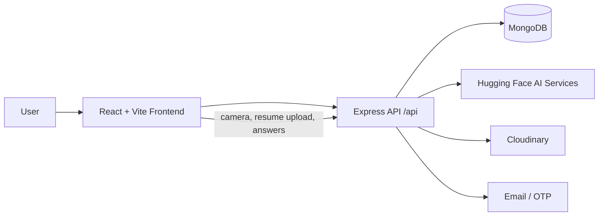

# AI Mock Interview

An AI-powered mock interview platform that generates role-specific interview questions from a resume, evaluates answers, analyzes resumes, and supports lightweight proctoring during interviews.

## What it does

- Generate personalized interviews from a resume, role, experience level, and tech stack
- Support technical, behavioral, and coding interview modes
- Evaluate answers with AI-backed scoring and feedback
- Run coding solutions against visible and hidden test cases
- Analyze resumes against an optional job description for ATS-style feedback
- Track interview history, progress, and profile details
- Capture proctoring events such as suspicious object detection and manual warnings
- Handle email OTP login and email verification

## Stack

- **Frontend:** React 19, Vite, React Router, Tailwind CSS, Axios, Lucide icons, TensorFlow.js utilities
- **Backend:** Node.js, Express, MongoDB, Mongoose, JWT, Multer, Nodemailer, Cloudinary
- **AI / automation:** Hugging Face inference APIs, PDF parsing, proctoring analysis, code execution sandboxing

## Architecture



## Repository structure

- `backend/` — Express API, controllers, services, models, and utility modules
- `frontend/` — React app, layouts, pages, reusable components, and API client

## Key features by area

### Authentication

- Register and login with email/password
- OTP verification for login and email confirmation
- Protected routes for dashboard and interview flows

### Interview flow

- Create a resume-based interview
- Choose role, experience level, interview type, and tech stack
- Take interviews with a timed, full-screen experience
- Submit answers one by one or at the end
- See scores, feedback, strengths, weaknesses, and improvement tips

### Coding interviews

- Generate coding questions with starter code and test cases
- Evaluate answers against visible and hidden test cases
- Support multiple languages through the code runner service

### Resume analysis

- Upload a resume and optionally paste a job description
- Get ATS-style scoring and resume improvement feedback

### Proctoring

- Camera checks before the interview starts
- Detect suspicious objects in frames
- Store and summarize proctoring events for each interview

## API summary

Base path: `/api`

### Auth

- `POST /auth/register`
- `POST /auth/login`
- `POST /auth/verify-login-otp`
- `POST /auth/send-otp`
- `POST /auth/verify-otp`
- `GET /auth/me`
- `GET /auth/profile`
- `PUT /auth/profile`

### Interviews

- `GET /interviews/stats`
- `POST /interviews`
- `GET /interviews`
- `GET /interviews/:id`
- `DELETE /interviews/:id`
- `POST /interviews/:id/submit-answer`
- `POST /interviews/:id/submit`
- `POST /interviews/run-code`

### Resume analysis

- `POST /resume/analyze`

### Proctoring

- `POST /proctoring/analyze`
- `POST /proctoring/event`
- `GET /proctoring/events/:interviewId`
- `GET /proctoring/summary/:interviewId`

### Health

- `GET /api/health`
- `GET /api/health/detailed`

## Prerequisites

- Node.js 18+ recommended
- MongoDB database connection string
- Cloudinary account for media storage
- SMTP account for email delivery
- Hugging Face API token for AI-driven generation and analysis

## Environment variables

Create a `backend/.env` file with values similar to these:

```env
PORT=5000
MONGO_URI=your_mongodb_connection_string
JWT_SECRET=your_jwt_secret
JWT_EXPIRES_IN=7d
OTP_EXPIRES_IN_MINUTES=10

CLOUDINARY_CLOUD_NAME=your_cloud_name
CLOUDINARY_API_KEY=your_cloudinary_key
CLOUDINARY_API_SECRET=your_cloudinary_secret

SMTP_HOST=smtp.example.com
SMTP_PORT=465
SMTP_USER=your_smtp_user
SMTP_PASS=your_smtp_password
SMTP_FROM="AI Mock Interview <no-reply@example.com>"

HF_API_TOKEN=your_huggingface_token
# or HUGGINGFACE_API_KEY=your_huggingface_token
HF_BASE_URL=https://api-inference.huggingface.co/models
HF_MODEL=mistralai/Mistral-7B-Instruct-v0.2
```

For the frontend, set an optional `frontend/.env` if you want to override the API base URL:

```env
VITE_API_BASE_URL=/api
```

## Setup

### Backend

1. Install dependencies in `backend/`
2. Create `backend/.env`
3. Start the server with the dev script

### Frontend

1. Install dependencies in `frontend/`
2. Start the Vite dev server

## Scripts

### Backend

- `npm run start` — start the API server
- `npm run dev` — start the API server
- `npm run dev:watch` — start the API server with nodemon

### Frontend

- `npm run dev` — start the Vite dev server
- `npm run build` — build the frontend for production
- `npm run lint` — run ESLint
- `npm run preview` — preview the production build

## Running locally

1. Start MongoDB and make sure the connection string in `backend/.env` is valid.
2. In one terminal, run the backend from `backend/`.
3. In another terminal, run the frontend from `frontend/`.
4. Open the frontend in your browser and create a mock interview.

The Vite dev server proxies `/api` requests to `http://localhost:5000`, so the frontend can talk to the backend without extra setup.

## How the flow works

1. Register or log in with email and OTP.
2. Upload a resume and choose a role, level, and interview type.
3. The backend generates personalized questions.
4. The interview runs with camera checks, timers, and proctoring events.
5. Answers are evaluated and scored.
6. Final results and history are saved for later review.

## Notes

- The current interview generation, resume analysis, and proctoring flows are built around Hugging Face services.
- Coding evaluation uses a local runner for supported languages and test cases.
- If MongoDB Atlas rejects the connection, check that your IP is whitelisted.

## Future ideas

- Add more interview templates and difficulty tuning
- Expand coding language support and sandboxing
- Improve analytics dashboards for progress tracking
- Add deployment presets for Render, Railway, or Vercel + separate API hosting

## License

No license file is currently included.
